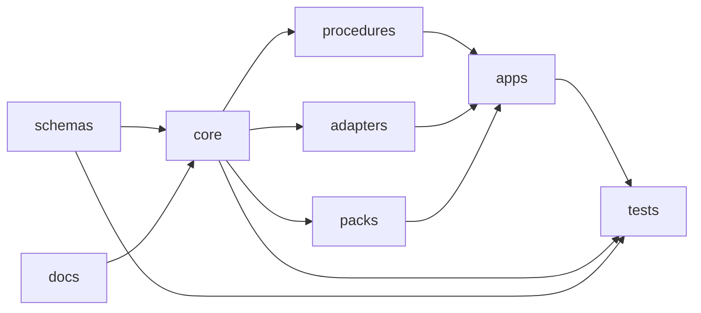

# dataspace-control-plane

A multi-ecosystem control plane for sovereign data exchange between organizations. Manages credential issuance, policy negotiation, Digital Product Passport lifecycle, connector registration, and durable workflow orchestration — under strict tenant isolation and cryptographic audit.

Implements the [Dataspace Protocol (DSP)](https://docs.internationaldataspaces.org/ids-knowledgebase/dataspace-protocol), the [Dataspace Connect Protocol (DCP)](https://docs.internationaldataspaces.org/ids-knowledgebase/v/dataspace-connect-protocol), and ecosystem overlays for Catena-X, Gaia-X, Manufacturing-X, ESPR (Ecodesign for Sustainable Products Regulation) Digital Product Passports, and Battery Passports on a [Temporal](https://temporal.io)-based durable workflow engine.

## Key Capabilities

- **Multi-ecosystem dataspace support** — Catena-X DSP/DCP protocol implementation, Gaia-X trust framework self-descriptions, Manufacturing-X connector interoperability, and [Open Digital Rights Language (ODRL)](https://www.w3.org/TR/odrl-model/) 2.2 policy evaluation.
- **EU product regulation tooling** — Battery Passport (Regulation 2023/1542, Annex XIII field tiers), ESPR Digital Product Passport (Regulation 2024/1781) creation and registry submission, with machine-readable OSCAL (Open Security Controls Assessment Language) evidence emission.
- **Durable workflow orchestration** — Temporal-based business workflows survive infrastructure failures without compensating transaction scaffolding. Workflow code is the runbook.
- **Tenant isolation and audit** — Keycloak realm-per-tenant model with short-lived JSON Web Tokens (JWTs), Vault Transit for signing operations, and PostgreSQL row-level security as the final tenant enforcement layer.

## Quick Start

```bash
# Clone
git clone https://github.com/hadijannat/dataspace-control-plane.git
cd dataspace-control-plane

# Install all Python and Node dependencies
make install

# Run unit tests (no live services required)
make test
```

**Prerequisites for quick start:** Python 3.12+, [uv](https://github.com/astral-sh/uv) 0.4+, Node.js 20+, [pnpm](https://pnpm.io) 9+, and Make.

> `make install` uses `uv pip install --system`. To install into a virtual environment instead, create and activate one first: `uv venv .venv && source .venv/bin/activate`.

## Architecture

Nine architectural layers, each with a single designated owner. No layer borrows logic from a layer it feeds.

| Directory | Layer | Role |
|-----------|-------|------|
| `core/` | Semantic kernel | Canonical domain models, invariants, procedure contracts, audit primitives |
| `procedures/` | Durable orchestration | Temporal workflows and activities; state machines; evidence emission |
| `adapters/` | Integration | Protocol normalizers ([Eclipse Dataspace Connector (EDC)](https://github.com/eclipse-edc/Connector), DSP, DCP, Gaia-X, [BaSyx](https://github.com/eclipse-basyx)); infrastructure integrations (Kafka, Vault, Postgres, Keycloak) |
| `packs/` | Ecosystem overlays | Catena-X, Gaia-X, Manufacturing-X, ESPR-DPP, Battery Passport rule sets |
| `schemas/` | Artifact registry | Pinned upstream standards ([Asset Administration Shell (AAS)](https://industrialdigitaltwin.org/), [ODRL](https://www.w3.org/TR/odrl-model/), and [W3C Verifiable Credentials](https://www.w3.org/TR/vc-data-model-2.0/)) + authored JSON Schema 2020-12 families (DPP, enterprise-mapping, metering) |
| `apps/` | Runtime surfaces | `control-api` (FastAPI), `temporal-workers`, `web-console`, `edc-extension`, `provisioning-agent` |
| `tests/` | Verification spine | Unit, integration, e2e, DSP/DCP [Technology Compatibility Kit (TCK)](https://en.wikipedia.org/wiki/Technology_Compatibility_Kit) suites, tenancy, crypto-boundaries, chaos |
| `infra/` | Delivery substrate | Helm charts, Terraform modules, Docker images, OpenTelemetry (OTel) Collector observability stack |
| `docs/` | Governance | [arc42](https://arc42.org) architecture, ADRs, API contracts, runbooks, threat model, compliance mappings |

### Dependency flow



## Prerequisites

**Required** for most development:

| Tool | Version | Purpose |
|------|---------|---------|
| Python | 3.12+ | All Python packages |
| [uv](https://github.com/astral-sh/uv) | 0.4+ | Python dependency management |
| Make | any | Build targets (`Makefile`) |
| Node.js | 20+ | `apps/web-console` and docs toolchain |
| [pnpm](https://pnpm.io) | 9+ | Node package manager |

<details>
<summary><strong>Layer-specific tools</strong> (only needed for their respective components)</summary>

| Tool | Version | Purpose |
|------|---------|---------|
| Java | 21 | `apps/edc-extension` (Gradle Kotlin DSL) |
| [Helm](https://helm.sh) | 3.14+ | `infra/helm` chart validation |
| [Terraform](https://terraform.io) | 1.7+ | `infra/terraform` environment validation |
| Docker | 24+ | Local compose environments and release gate suites |
| [go-task](https://taskfile.dev) | 3+ | Optional — mirrors Make targets via `Taskfile.yml` |

</details>

## Development

### Per-layer tests

Each target exercises one architectural layer. These run offline — no live services required.

```bash
make test             # unit spine + schema compat + app tests (no live services)
make test-core        # core/ — unit tests
make test-schemas     # schemas/ — unit + offline schema validation
make test-procedures  # procedures/ — unit + replay tests
make test-adapters    # adapters/ — pure-Python adapter contracts
make test-packs       # packs/ — unit + integration
make test-apps        # apps/ — control-api + temporal-workers tests
make test-infra       # infra/ — helm lint + terraform validate
make test-docs        # docs/ — markdownlint + Redocly lint + MkDocs strict build
```

### Linting

```bash
make lint             # all linters: ruff + ESLint + markdownlint + helm lint
make lint-python      # ruff check across all Python packages
make lint-node        # ESLint for web-console
make lint-docs        # markdownlint for docs/
make lint-infra       # helm lint for infra/helm/
```

<details>
<summary><strong>Release gate and chaos suites</strong> (requires live services)</summary>

These suites require a running local environment with Temporal, Postgres, Vault, and Kafka (see `infra/docker/compose/`).

```bash
make test-gates       # DSP TCK + DCP TCK + tenancy + crypto-boundaries

# Individual gate suites
pytest tests/compatibility/dsp-tck --live-services
pytest tests/compatibility/dcp-tck --live-services
pytest tests/tenancy --live-services
pytest tests/crypto-boundaries --live-services
```

Chaos tests require a dedicated fault-injection environment:

```bash
make test-chaos
```

</details>

<details>
<summary><strong>go-task equivalents</strong></summary>

All Make targets are mirrored in `Taskfile.yml` for [go-task](https://taskfile.dev) users:

```bash
task install          # install all dependencies
task test             # run unit tests
task test:gates       # run release gate suites
task lint             # run all linters
task docs:serve       # serve docs site
task clean            # remove build artifacts
```

</details>

## Documentation

The documentation site covers architecture ([arc42](https://arc42.org)), architecture decision records, OpenAPI 3.1 API reference, operational runbooks, STRIDE (Spoofing, Tampering, Repudiation, Information Disclosure, Denial of Service, Elevation of Privilege) threat model, compliance mappings, and a [glossary](docs/glossary.md) of all domain terms and protocol acronyms.

Built with [MkDocs Material](https://squidfunk.github.io/mkdocs-material/):

```bash
make docs-serve       # live preview at http://127.0.0.1:8000
make docs-build       # build to site/ (strict mode)
```

The docs toolchain uses both Python (`docs/requirements.txt` — MkDocs, Material, extensions) and Node.js (`docs/package.json` — markdownlint-cli2, Redocly CLI for OpenAPI linting). Both are installed by `make install`.

## Contributing

1. Read [`docs/agents/ownership-map.md`](docs/agents/ownership-map.md) to understand the layer ownership model.
2. Keep each PR within one top-level directory. Cross-boundary changes require a written plan following the format in [`PLANS.md`](PLANS.md).
3. Run `make lint` and `make test` (plus the relevant `make test-<dir>` target) before submitting.
4. Release gate suites (`make test-gates`) must pass before merge to main.

For architecture guidebooks, orchestration rules, and the full ownership map, see the [`docs/agents/`](docs/agents/index.md) directory.

### AI-assisted development

This repository supports [Claude Code](https://claude.ai/code) agent-teams with a 4-wave build model. Agent configuration, subagent definitions, and wave management skills are provisioned locally via `CLAUDE.md` and `.claude/` (both gitignored — not part of the cloned repository). Tracked architecture guides live in [`docs/agents/`](docs/agents/index.md).

## Project Navigation

| Resource | Purpose |
|----------|---------|
| [`PLANS.md`](PLANS.md) | Planning rules and required plan shape |
| [`CODEOWNERS`](CODEOWNERS) | GitHub ownership assignments |
| [`Makefile`](Makefile) | All build, test, lint, and docs targets |
| [`Taskfile.yml`](Taskfile.yml) | go-task mirror of Makefile targets |
| [`docs/agents/index.md`](docs/agents/index.md) | Architecture guidebook index |
| [`docs/agents/ownership-map.md`](docs/agents/ownership-map.md) | Layer boundary rules and forbidden zones |
| [`docs/agents/orchestration-guide.md`](docs/agents/orchestration-guide.md) | Cross-layer coordination rules |
| [`docs/glossary.md`](docs/glossary.md) | Definitions of all domain terms and protocol acronyms |
