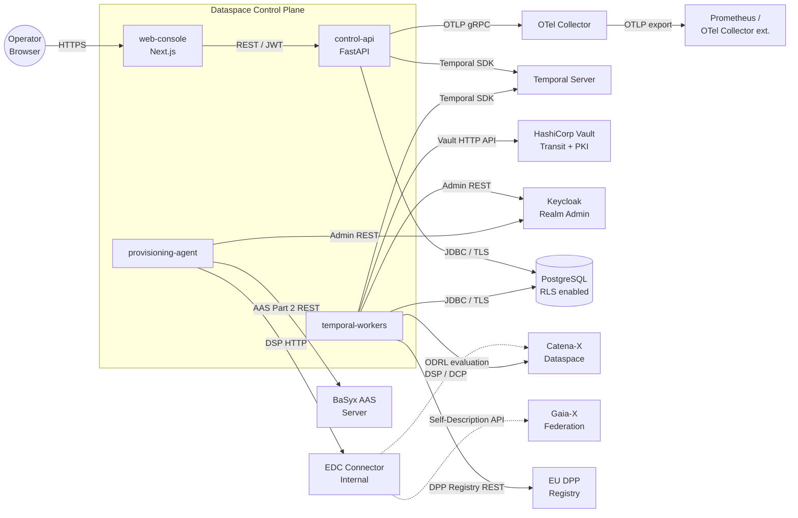

## Business Context

The Dataspace Control Plane sits at the intersection of multiple regulated ecosystems and enterprise systems. Its business scope is to broker data sharing agreements between industrial organizations while generating the cryptographically verifiable evidence required by regulators and dataspace operators.

**External actors and their relationships to the platform:**

| Actor | Interaction | Direction |
|-------|-------------|-----------|
| **Platform operator** | Manages companies, monitors workflows, triggers manual operations via web-console | Operator → Platform |
| **Catena-X dataspace** | Catalog discovery, contract negotiation, data transfer via DSP; credential presentation via DCP | Bidirectional |
| **Gaia-X federation** | Self-Description publication, compliance label verification | Platform → Gaia-X |
| **Enterprise data systems** | SAP ERP, OData APIs, JDBC sources — mapped to canonical models via enterprise adapters | Enterprise → Platform |
| **EDC connectors (external partners)** | DSP wire protocol for catalog and negotiation; DCP for credential exchange | Bidirectional |
| **EU DPP Registry** | Battery Passport and ESPR DPP submission, status queries | Platform → Registry |
| **Auditors / Regulatory authority** | Pull evidence artifacts and compliance reports on demand | Auditor → Platform |
| **BaSyx AAS Server** | Digital Twin shell and submodel storage; AAS Part 2 REST API | Platform → BaSyx |

## System Context Diagram

## Technical Interfaces

All external interfaces are listed here. Changes to any interface require updating this section and the relevant adapter module.

| Interface | Protocol | Direction | Adapter / Module |
|-----------|---------|-----------|----------------|
| Temporal gRPC | gRPC + TLS | Platform → Temporal Server | `temporalio` Python SDK |
| Vault HTTP API (Transit) | HTTPS REST | Platform → Vault | `adapters/infra/vault/` |
| Vault HTTP API (PKI) | HTTPS REST | Platform → Vault | `adapters/infra/vault/` |
| Keycloak Admin REST | HTTPS REST | Platform → Keycloak | `adapters/infra/keycloak/` |
| Keycloak OIDC (token issuance) | HTTPS OpenID Connect | Operator/Service → Keycloak | Keycloak standard endpoint |
| PostgreSQL wire protocol | TCP TLS + PG wire | Platform → Postgres | SQLAlchemy async + asyncpg |
| DSP Catalog Protocol | HTTPS JSON-LD | Platform ↔ EDC connector | `adapters/dataspace/dsp/` |
| DCP Credential Service | HTTPS JSON-LD | Platform ↔ EDC connector | `adapters/dataspace/dcp/` |
| AAS Part 2 REST | HTTPS JSON | Platform → BaSyx | `adapters/aas/basyx/` |
| EU DPP Registry API | HTTPS REST | Platform → DPP Registry | `adapters/dataspace/dpp_registry/` |
| Gaia-X Self-Description API | HTTPS JSON-LD | Platform → Gaia-X | `adapters/dataspace/gaia_x/` |
| OTLP gRPC (telemetry) | gRPC + TLS | Platform → OTel Collector | OpenTelemetry Python SDK |
| Kafka (metering events) | Kafka binary | Platform → Kafka | `adapters/messaging/kafka/` |
| control-api HTTP | HTTPS REST | Operator/Service → control-api | `apps/control-api/` |

## Scope Exclusions

The following are explicitly outside the platform's scope:

- **Data plane operations**: The platform manages control plane workflows (negotiation, agreement, policy evaluation) but does not transfer the actual data payloads — that is the EDC data plane's responsibility.
- **Long-term archival storage**: The platform stores evidence artifacts in Postgres and Kafka; long-term cold archival to object storage is an infrastructure concern, not a platform concern.
- **Consumer applications**: The web-console is an operator tool, not an end-user product. Consumer-facing DPP portals are separate applications that query the DPP registry.
- **CI/CD pipeline**: The `infra/` layer provides container images and Helm charts; the CI/CD runner (GitHub Actions) is outside the platform boundary.
