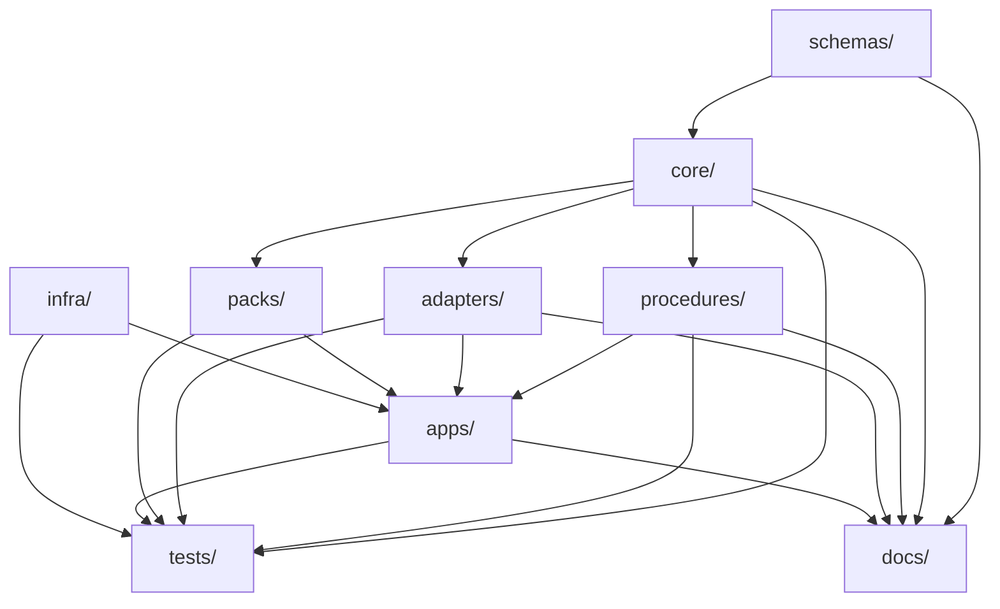

## Level 1 — Repository Layers

The repository is divided into 9 strictly-owned layers. The dependency flow is strictly downward: `schemas/` and `docs/` feed `core/`; `core/` feeds `procedures/`, `adapters/`, and `packs/`; those feed `apps/`; everything feeds `tests/`.

| Layer | Directory | Role | Upstream dependencies | Downstream consumers |
|-------|-----------|------|--------------------|---------------------|
| Semantic kernel | `core/` | Canonical models, invariants, domain events, audit primitives. Defines meaning — nothing else may. | `schemas/` | `procedures/`, `adapters/`, `packs/` |
| Contract registry | `schemas/` | JSON Schema 2020-12 families, vendor-pinned upstream artifacts, provenance manifests | None | `core/`, `adapters/`, `procedures/`, `packs/` |
| Durable orchestration | `procedures/` | Temporal workflows, state machines, evidence emission. No integration logic. | `core/`, `schemas/` | `apps/` |
| Integration | `adapters/` | Protocol normalization for DSP, DCP, AAS, Gaia-X, enterprise APIs, Kafka, Vault, Keycloak | `core/`, `schemas/` | `apps/`, `procedures/` |
| Runtime surfaces | `apps/` | Thin compositional entrypoints: control-api, temporal-workers, web-console, provisioning-agent, edc-extension | `procedures/`, `adapters/`, `packs/` | — |
| Ecosystem overlays | `packs/` | Catena-X, Gaia-X, Manufacturing-X, ESPR-DPP, Battery Passport rules. Pure overlays over core. | `core/`, `schemas/` | `apps/`, `procedures/` |
| Delivery substrate | `infra/` | Helm charts, Terraform modules, Docker images, OTel Collector config | — | `apps/`, `procedures/` |
| Verification | `tests/` | pytest suites: unit, integration, e2e, tenancy, crypto-boundaries, chaos, TCK compatibility | All layers | — |
| Governance | `docs/` | Architecture documentation, ADRs, API reference, runbooks, threat models, compliance mappings | — | All layers (reference) |

### Layer Dependency Diagram

## Level 2 — schemas/ Families

The `schemas/` layer organizes JSON Schema 2020-12 documents into six families. Each family has a `source/` subdirectory for hand-authored schemas, a `derived/` subdirectory for generated variants, a `vendor/` subdirectory for pinned upstream artifacts, and a `bundles/` subdirectory for Redocly-bundled outputs.

| Family | `$schema` prefix | Coverage |
|--------|-----------------|---------|
| `vc` | `schemas/vc/source/` | W3C VC Data Model 2.0: credential envelope, credential status (Bitstring Status List), DID document, verifiable presentation |
| `odrl` | `schemas/odrl/source/` | W3C ODRL 2.2: policy offer, policy agreement, constraint, permission, prohibition |
| `aas` | `schemas/aas/source/` | IDTA AAS Release 25-01: shell descriptor, submodel, concept description, operation |
| `dpp` | `schemas/dpp/source/` | DPP 4.0: passport base, access class, evidence envelope, registry envelope, export formats |
| `metering` | `schemas/metering/source/` | Usage events: usage-record, CloudEvents envelope, settlement batch, metering aggregate |
| `enterprise-mapping` | `schemas/enterprise-mapping/source/` | Field mapping DSL: mapping document, field path, lineage entry, transformation specification |

All source schemas must declare `"$schema": "https://json-schema.org/draft/2020-12/schema"`. Vendor-pinned artifacts in `vendor/` are exempt from this requirement but must include a `provenance.json` file with SHA-256 digest, upstream URL, and pin date.

## Level 2 — adapters/ Modules

The `adapters/` layer normalizes external protocols and infrastructure APIs into core ports. Each module owns exactly one external system or protocol family:

| Module | Path | Normalizes |
|--------|------|-----------|
| DSP adapter | `adapters/dataspace/dsp/` | Dataspace Protocol (catalog, negotiation, transfer) messages |
| DCP adapter | `adapters/dataspace/dcp/` | Dataspace Connect Protocol credential presentations |
| Gaia-X adapter | `adapters/dataspace/gaia_x/` | Self-Description publication and trust label validation |
| DPP Registry adapter | `adapters/dataspace/dpp_registry/` | EU DPP registry submission and status queries |
| AAS adapter | `adapters/aas/basyx/` | BaSyx AAS Server Part 2 REST API |
| Enterprise adapter | `adapters/enterprise/` | SAP OData, JDBC, REST enterprise sources via field-mapping DSL |
| Kafka adapter | `adapters/messaging/kafka/` | Metering event publication and consumption |
| Vault adapter | `adapters/infra/vault/` | Transit signing, PKI certificate issuance |
| Keycloak adapter | `adapters/infra/keycloak/` | Realm management, user/client provisioning |

## Level 2 — packs/ Modules

The `packs/` layer provides ecosystem and regulatory overlays. Each pack implements the shared SDK interface defined in `packs/_shared/`:

| Pack | Path | Overlay scope |
|------|------|--------------|
| Catena-X | `packs/catenax/` | ODRL policy profiles, VC credential types, DSP compliance rules, Catena-X Operating Model 4.0 obligations |
| Gaia-X | `packs/gaia_x/` | Self-Description generation, Gaia-X Trust Framework 22.10 label rules |
| Manufacturing-X | `packs/manufacturing_x/` | Manufacturing-X connector profiles, sector-specific extensions |
| ESPR DPP | `packs/espr_dpp/` | EU Regulation 2024/1781 obligations, delegated act templates, DPP field completeness validators |
| Battery Passport | `packs/battery_passport/` | EU Regulation 2023/1542 Annex XIII field tiers, BattID generation, AAS serialization profile |

The shared SDK (`packs/_shared/`) provides: `PackReducer` (composable rule application with conflict detection), `PackManifest` (metadata and dependency declaration), `PackValidator` (schema-backed field completeness check), and `PackInterface` (abstract base class enforcing the overlay contract).

## Level 2 — apps/ Runtime Surfaces

Each app in `apps/` is a thin entrypoint that composes layers without containing business logic:

| App | Path | Technology | Role |
|-----|------|-----------|------|
| control-api | `apps/control-api/` | FastAPI + Uvicorn | HTTP API for operators and machine integrations. OpenAPI 3.1 spec at `docs/api/openapi/source/control-api.yaml`. |
| temporal-workers | `apps/temporal-workers/` | Temporal Python SDK + asyncio | Activity and workflow implementations wired to procedures/ and adapters/ |
| web-console | `apps/web-console/` | Next.js 14 + React | Operator dashboard for company management, workflow monitoring, DPP lifecycle |
| edc-extension | `apps/edc-extension/` | Java (EDC extension API) | Hooks into the EDC connector to delegate policy evaluation and signing to the platform |
| provisioning-agent | `apps/provisioning-agent/` | Python + HTTPX | Manages EDC connector registration, AAS shell provisioning, Keycloak realm bootstrapping |
