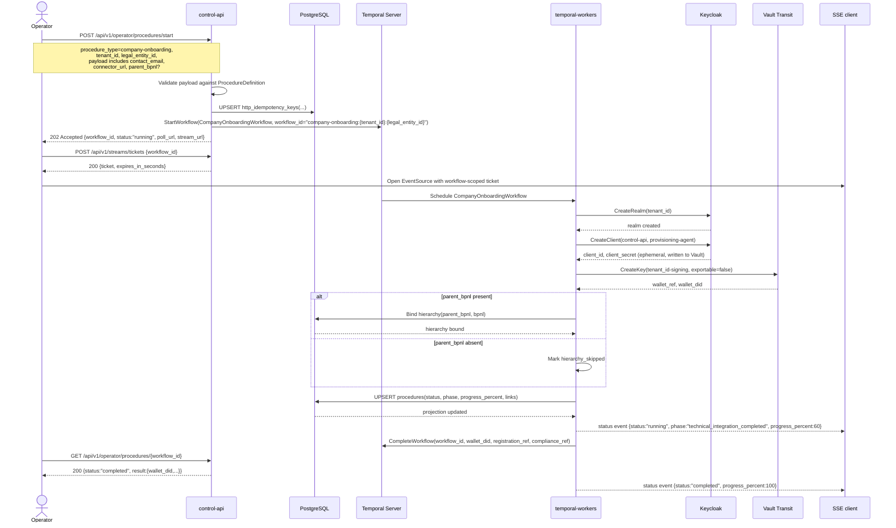
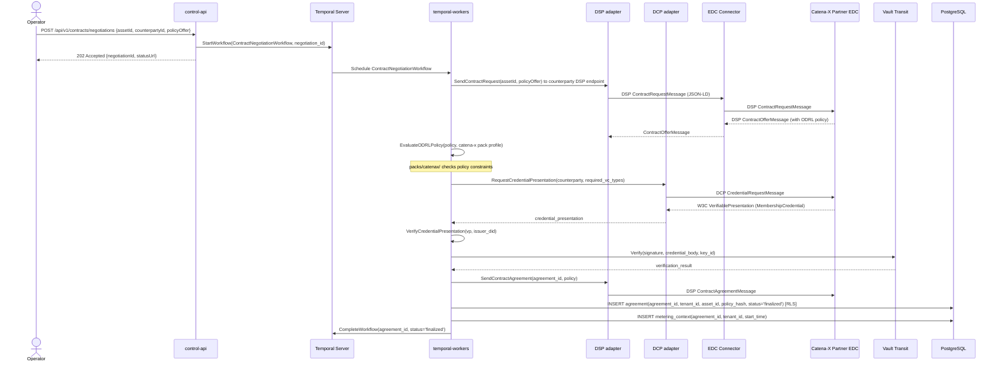
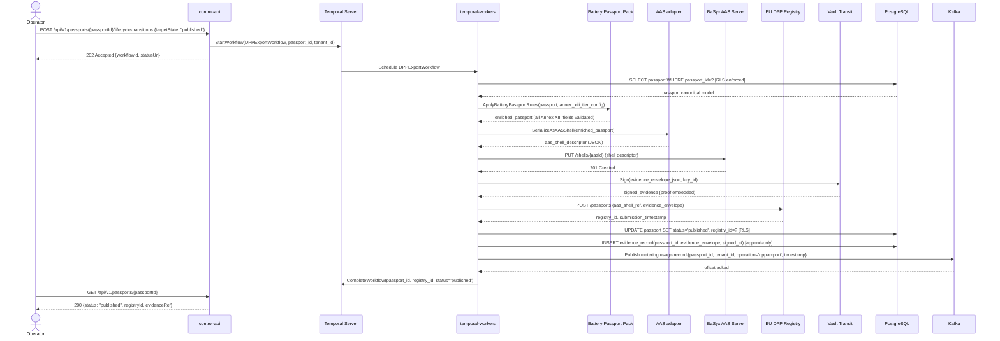

The runtime view documents the most important dynamic behaviors of the platform as sequence diagrams. Each scenario corresponds to a Temporal workflow in `procedures/`.

## Scenario 1: Company Onboarding

Company onboarding starts through the generic procedure API, uses a manifest
derived business-key workflow ID, persists durable HTTP idempotency state, and
returns a workflow handle immediately. The workflow then provisions a tenant,
bootstraps wallet and connector state, conditionally binds hierarchy when
`parent_bpnl` is provided, and reports live phase and progress through a
workflow query.

**Key invariants:**

- `client_secret` is written to Vault immediately after Keycloak creates it; it is never logged or stored in Postgres.
- Wallet bootstrap persists both `wallet_ref` and the externally visible `wallet_did`; the workflow result returns the DID, not the internal reference.
- Hierarchy binding is authoritative on the activity result: when `parent_bpnl` is absent, onboarding skips the hierarchy-bound phase instead of claiming success.
- The API rejects duplicate active onboarding runs for the same `{tenant_id, legal_entity_id}` business key with `409`.

## Scenario 2: Contract Negotiation

Contract negotiation implements the DSP negotiation state machine: offer → agreed → verified → finalized. An ODRL policy offer from a Catena-X partner is evaluated, a DCP credential presentation is required, and the agreement is recorded in Postgres.

## Scenario 3: DPP Passport Export

The DPP export workflow applies the Battery Passport or ESPR pack, serializes the passport as an AAS shell, submits it to the EU DPP registry, and emits evidence.

**Key invariants:**

- Evidence is signed before registry submission; if signing fails, the workflow retries the sign activity (idempotent via Vault key_id + payload hash).
- The metering event is published after Postgres commit; if Kafka publish fails, the activity retries — the usage-record schema includes an idempotency key.
- Evidence records are append-only; no UPDATE on the evidence table is permitted.
