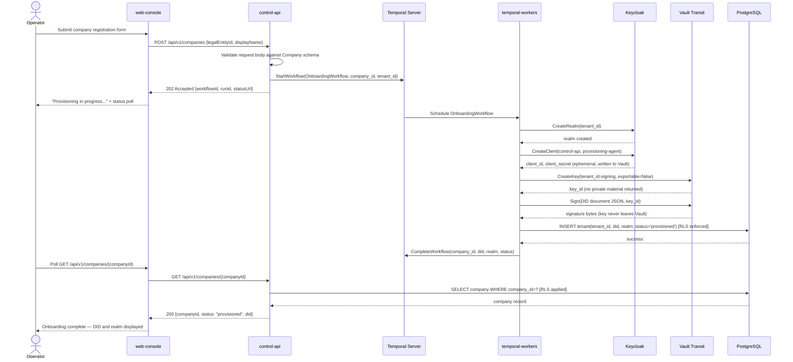
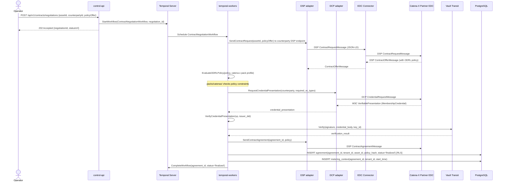
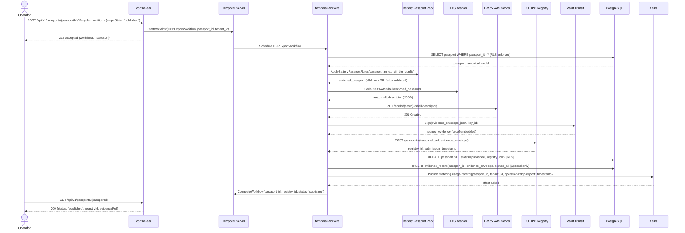

The runtime view documents the most important dynamic behaviors of the platform as sequence diagrams. Each scenario corresponds to a Temporal workflow in `procedures/`.

## Scenario 1: Company Onboarding

Company onboarding provisions a new tenant: creates a Keycloak realm, issues a DID document signed by Vault Transit, creates the Postgres tenant record with RLS, and returns the operator's credentials.

**Key invariants:**

- `client_secret` is written to Vault immediately after Keycloak creates it; it is never logged or stored in Postgres.
- The DID document is signed before the tenant record is written; if signing fails, the tenant record is never created.
- The workflow is idempotent: if restarted after Postgres write, the existing record is returned.

## Scenario 2: Contract Negotiation

Contract negotiation implements the DSP negotiation state machine: offer → agreed → verified → finalized. An ODRL policy offer from a Catena-X partner is evaluated, a DCP credential presentation is required, and the agreement is recorded in Postgres.

## Scenario 3: DPP Passport Export

The DPP export workflow applies the Battery Passport or ESPR pack, serializes the passport as an AAS shell, submits it to the EU DPP registry, and emits evidence.

**Key invariants:**

- Evidence is signed before registry submission; if signing fails, the workflow retries the sign activity (idempotent via Vault key_id + payload hash).
- The metering event is published after Postgres commit; if Kafka publish fails, the activity retries — the usage-record schema includes an idempotency key.
- Evidence records are append-only; no UPDATE on the evidence table is permitted.
