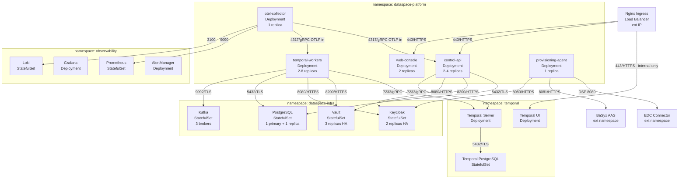

# 7. Deployment View

## Kubernetes Namespace Layout

The platform is deployed on Kubernetes, split across four namespaces with strict network policy boundaries. Cross-namespace traffic is permitted only on the interfaces documented in [Section 3 (Context and Scope)](03-context-and-scope.md).



## Component Resources

| Component | CPU request | CPU limit | Memory request | Memory limit | Storage |
|-----------|------------|-----------|---------------|-------------|---------|
| control-api | 250m | 1000m | 512Mi | 1Gi | — |
| temporal-workers | 500m | 2000m | 1Gi | 2Gi | — |
| web-console | 100m | 500m | 256Mi | 512Mi | — |
| provisioning-agent | 100m | 500m | 256Mi | 512Mi | — |
| PostgreSQL | 500m | 2000m | 2Gi | 4Gi | 50Gi SSD PVC |
| Vault | 250m | 1000m | 512Mi | 1Gi | 10Gi SSD PVC |
| Keycloak | 500m | 2000m | 1Gi | 2Gi | PostgreSQL (shared) |
| Temporal Server | 500m | 2000m | 1Gi | 2Gi | Temporal PostgreSQL |
| Kafka | 1000m | 4000m | 2Gi | 4Gi | 100Gi SSD PVC per broker |

## Infrastructure Provisioning Order

Infrastructure is provisioned in a strict order to ensure each layer's dependencies are available before it is installed. This order is enforced by Terraform module `depends_on` declarations and Helm post-install hooks.

```
Step 1: terraform bootstrap
  → Creates: VPC, subnets, DNS zones, TLS certificates (ACM/Vault PKI bootstrap)
  → Outputs: cluster endpoint, service account annotations

Step 2: terraform platform
  → Creates: PostgreSQL cluster, Keycloak deployment, Vault cluster + auto-unseal config, Kafka cluster, Nginx ingress
  → Outputs: connection strings, Keycloak admin credentials (stored in Vault), Vault root token (rotated immediately)

Step 3: docker bake release
  → Builds and pushes: control-api, temporal-workers, web-console, provisioning-agent images
  → Tags with git SHA; pushes to internal registry

Step 4: helm upgrade dataspace-platform
  → Installs: control-api, temporal-workers, web-console, provisioning-agent, otel-collector
  → Requires: Vault, Keycloak, PostgreSQL ready (checked via Helm pre-install hook)
  → Post-install: runs database migrations, bootstraps Temporal namespace, seeds Keycloak realm template

Step 5: terraform observability
  → Creates: Prometheus, Grafana, Loki, AlertManager
  → Configures: Grafana data sources, dashboard provisioning from infra/observability/dashboards/

Step 6: helm upgrade otel-collector
  → Configures: OTLP receiver, redaction processor (blocks token/key/password patterns), Prometheus exporter, Loki exporter
```

## Vault Initialization and Seal Management

Vault is initialized once during bootstrap. The initialization sequence:

1. `vault operator init -key-shares=5 -key-threshold=3` → generates 5 unseal key shards and the root token
2. Unseal key shards are distributed to 3 separate Vault operators via secure channel (PGP-encrypted)
3. Root token is used once to configure auth methods, then revoked
4. Auto-unseal is configured using cloud KMS (AWS KMS or GCP Cloud KMS) for HA deployments
5. Vault policies for platform service accounts are applied via Terraform `vault` provider

See [runbooks/platform/vault-key-rotation.md](../runbooks/platform/vault-key-rotation.md) for key rotation procedure.

## Ingress and TLS

All public-facing ingress is TLS-terminated at the Nginx ingress controller. Certificates are managed by cert-manager with Vault PKI as the issuer for internal services and Let's Encrypt for public endpoints.

| Host | Target service | Certificate issuer |
|------|---------------|-------------------|
| `api.your-org.internal` | control-api | Vault PKI (internal CA) |
| `console.your-org.internal` | web-console | Vault PKI (internal CA) |
| `temporal.your-org.internal` | Temporal UI | Vault PKI (internal CA, restricted to VPN) |
| `api.your-org.com` | control-api | Let's Encrypt (public) |

## Environment Tiers

| Tier | Purpose | Notes |
|------|---------|-------|
| `local` | Developer local development | `docker compose up` with mock Vault and Keycloak |
| `dev` | Integration testing of in-progress features | Full Kubernetes stack, auto-deployed from `main` branch |
| `staging` | Pre-release validation | Production-equivalent config; TCK compatibility tests run here |
| `prod` | Production | HA Vault, HA Keycloak, multi-AZ PostgreSQL, PagerDuty alerting |
