# 10. Quality Requirements

## Quality Tree

```mermaid
graph TD
    Q[Quality]

    Q --> REL[Reliability]
    Q --> SEC[Security]
    Q --> COMP[Compliance]
    Q --> OBS[Observability]
    Q --> MAINT[Maintainability]
    Q --> TEST[Testability]

    REL --> REL1[Workflow durability\nTemporal survives infra failures]
    REL --> REL2[Retry safety\nActivities idempotent]
    REL --> REL3[Evidence immutability\nAppend-only records]

    SEC --> SEC1[Tenant isolation\nRLS as final guard]
    SEC --> SEC2[Machine trust boundaries\nVault Transit only signing]
    SEC --> SEC3[No key material in state\nVault exportable=false]

    COMP --> COMP1[Protocol conformance\nDSP / DCP / ODRL / VC]
    COMP --> COMP2[Regulatory alignment\nBattery Passport Annex XIII]
    COMP --> COMP3[Schema conformance\nJSON Schema 2020-12 gate]

    OBS --> OBS1[OTLP telemetry\nTraces + metrics + logs]
    OBS --> OBS2[Dashboard coverage\nAll critical paths]
    OBS --> OBS3[Alert SLOs\nP1 < 5min, P2 < 30min]

    MAINT --> MAINT1[Semantic kernel isolation\ncore/ owns meaning]
    MAINT --> MAINT2[Schema governance\nbreaking-change detection]
    MAINT --> MAINT3[Pack composability\npure overlay model]

    TEST --> TEST1[Property-based tests\nHypothesis for parsers]
    TEST --> TEST2[Replay safety\nTemporal history replay]
    TEST --> TEST3[Tenancy gate\ncross-tenant leakage tests]
    TEST --> TEST4[Crypto boundary gate\nno raw key detection]
```

## Quality Scenarios

Quality scenarios make quality goals testable by specifying: stimulus, environment, response, and response measure.

| # | Quality Goal | Stimulus | Environment | Response | Response Measure |
|---|-------------|---------|-------------|---------|----------------|
| QS-01 | Durable execution | Postgres pod is killed during a contract negotiation workflow activity | `dev` / `staging` environment under normal load | Temporal retries the failed activity; workflow continues from the last successful checkpoint | Workflow completes within 5 minutes of Postgres restoration; no duplicate agreements created |
| QS-02 | Tenant isolation | Authenticated request includes a forged `X-Tenant-ID` header referencing another tenant | Production; RLS enabled; application running as non-superuser | PostgreSQL RLS policy returns zero rows; API returns 404 or empty list | `tests/tenancy/test_cross_tenant_isolation.py` passes; no data from target tenant appears in response |
| QS-03 | Evidence immutability | Attacker attempts to UPDATE an evidence record via a SQL query | Postgres; application running as non-superuser `dataspace_app` role | `UPDATE` on `evidence_records` table is denied by Postgres GRANT | `tests/crypto-boundaries/` gate: UPDATE attempt returns `ERROR: permission denied for table evidence_records` |
| QS-04 | Protocol compliance | External EDC connector sends a DSP ContractRequestMessage | Staging with a real EDC counterparty (test connector) | DSP adapter normalizes the message; negotiation workflow starts; DSP ContractAgreementMessage is returned | `tests/compatibility/dsp-tck` suite passes with zero non-conformance findings |
| QS-05 | Vault Transit key custody | Security team audits signing key usage | Production; Vault audit backend enabled | Vault audit log shows all signing operations with caller identity, key ID, and timestamp; no key export operations appear | `tests/crypto-boundaries/vault_transit/test_no_key_export.py` passes; Vault audit log query returns zero `export` operations |
| QS-06 | Replay safety | A Temporal workflow is interrupted mid-execution and replayed from history | Integration test using `WorkflowEnvironment` | Workflow replay produces identical side effects in identical order | `tests/integration/replay/` suite passes; determinism checker reports no non-determinism |
| QS-07 | Battery Passport field completeness | A Battery Passport is submitted for DPP export with a missing Annex XIII mandatory field | `dev` environment | Battery Passport pack validator rejects the passport; workflow returns `FAILED` with field path error | `tests/unit/packs/validators/test_battery_passport_validators.py` → `ValidationError` raised with correct field path |
| QS-08 | OTLP trace redaction | A service logs a Vault token value in a trace attribute by mistake | `dev` / `staging` OTel Collector with redaction processor active | Collector's redaction processor replaces the token value with `[REDACTED]` before export | Grafana Tempo shows `[REDACTED]` in the span attribute; raw token value does not appear in any stored trace |

## Response-Time Targets

| Operation | P50 target | P95 target | P99 target |
|-----------|-----------|-----------|-----------|
| `GET /health/ready` | < 10ms | < 30ms | < 100ms |
| `GET /api/v1/companies/{id}` | < 50ms | < 200ms | < 500ms |
| `POST /api/v1/contracts/negotiations` (202 return) | < 100ms | < 500ms | < 1s |
| Contract negotiation workflow (end-to-end) | < 30s | < 2min | < 5min |
| DPP export workflow (end-to-end) | < 60s | < 5min | < 15min |
| Vault Transit sign operation | < 20ms | < 100ms | < 500ms |
