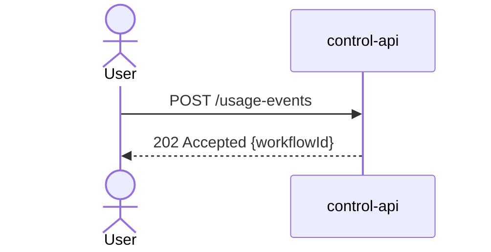

# Documentation Style Guide

This guide defines the authoring rules that every contributor must follow when adding or modifying pages in `docs/`. The rules exist to keep the MkDocs + Material site buildable without warnings (`mkdocs build --strict`), keep diagrams machine-renderable, and keep compliance-relevant pages auditable.

## Required Front Matter

Every Markdown file published through MkDocs must begin with a YAML front matter block containing these fields:

```yaml
---
title: "Short descriptive title"
summary: "One sentence describing what this page covers."
owner: <lead-name>        # e.g. docs-lead, infra-lead
last_reviewed: "YYYY-MM-DD"
status: draft | review | approved | deprecated
---
```

**Status values:**

| Value | Meaning |
|-------|---------|
| `draft` | Work in progress — do not rely on this page for operational decisions |
| `review` | Complete but awaiting peer review |
| `approved` | Reviewed and authoritative |
| `deprecated` | Superseded by another page; kept for historical reference only |

Pages with `status: draft` render a warning admonition automatically via the MkDocs Material tags plugin. Runbooks must be `status: approved` before they are referenced in on-call documentation.

## Link Rules

Use **relative Markdown links only**. MkDocs rewrites relative `.md` links to the correct HTML paths during build. Absolute paths (starting with `/` or `https://`) break after deployment if the `site_url` changes or if the site is served from a sub-path.

**Correct:**

```markdown
See the [Glossary](../glossary.md) for term definitions.
See [ADR 0002](../adr/0002-adopt-temporal-as-workflow-engine.md) for the Temporal decision.
```

**Incorrect:**

```markdown
See the [Glossary](/docs/glossary.md).       <!-- breaks after deploy -->
See the [Glossary](https://docs.internal/...). <!-- breaks in offline builds -->
```

For links to sections within a page, use the MkDocs-generated anchor format: `[section title](page.md#section-slug)`.

## Diagram Rules

All diagrams **must** be Mermaid fenced code blocks. Do not include screenshots of diagrams, draw.io exports as PNG, or embedded SVGs. Screenshots cannot be version-controlled meaningfully, cannot be rendered offline, and cannot be searched.

Mermaid diagrams render automatically in MkDocs Material via `pymdownx.superfences`. The Mermaid fenced block:

````markdown

````

Renders as:


Supported diagram types: `sequenceDiagram`, `graph`, `flowchart`, `classDiagram`, `stateDiagram-v2`, `erDiagram`, `gantt`, `block-beta`. Use `graph LR` for left-to-right architecture diagrams and `graph TB` for top-to-bottom deployment views.

## ADR Rules

Architecture Decision Records follow the [MADR (Markdown Architectural Decision Records)](https://adr.github.io/madr/) format. Rules:

- One decision per file.
- Use `docs/adr/_template.md` as the starting point.
- Filename format: `NNNN-short-slug.md` where NNNN is zero-padded (e.g., `0001-use-mkdocs-material.md`).
- Link every ADR from `docs/arc42/09-architecture-decisions.md` and from `docs/adr/index.md`.
- Status transitions: `proposed` → `accepted` or `deprecated`. Superseded ADRs set `status: superseded` and link to the superseding ADR.
- Do not embed implementation details — ADRs record the decision and its context, not the implementation.

## Runbook Rules

Runbooks must use `docs/runbooks/_template.md` as the starting point. Additional rules:

- `last_reviewed` must be within the past 90 days for runbooks with `severity: P1` or `P2`. Stale runbooks must be flagged in the quarterly review.
- Every runbook must have a **Remediation / Rollback** section — even if it only says "contact infra-lead".
- Investigation commands must be copy-pasteable without modification (use `<placeholder>` for values that require substitution).
- Do not record secrets, credentials, or private key material in runbooks.
- Link related runbooks at the bottom of every runbook.

## Heading Depth

The page `title` in front matter serves as H1. **Start the page body at H2** (`##`). Do not use H1 (`#`) inside the page body — it creates a duplicate heading in the rendered TOC.

**Correct heading structure:**

```markdown
---
title: "Page Title"
---

## First Section

### Subsection

#### Deep subsection (use sparingly)
```

The TOC integration feature (`toc.integrate`) places the table of contents inside the left navigation panel. Keep heading depth to H3 where possible to avoid a cluttered TOC.

## Code Blocks

Always specify the language identifier for syntax highlighting. MkDocs Material uses Pygments via `pymdownx.highlight`.

| Content type | Language identifier |
|-------------|---------------------|
| Python | `python` |
| YAML | `yaml` |
| JSON | `json` |
| Bash / Shell commands | `bash` |
| SQL | `sql` |
| HTTP request/response | `http` |
| OpenAPI / YAML config | `yaml` |
| Mermaid diagram | `mermaid` |
| Kubernetes manifest | `yaml` |

Do not use bare ` ``` ` fences without a language — they render as plain text and defeat syntax highlighting.

## Generated vs Hand-Written Content

Files under `docs/generated/` are **auto-generated** by platform tooling and must not be edited by hand:

| File | Generator | Trigger |
|------|-----------|---------|
| `docs/generated/schemas-index.md` | `schemas/tools/generate_docs.py` | Run after schema changes |
| `docs/api/openapi/bundled/control-api.yaml` | `redocly bundle ...` | Run after OpenAPI source changes |

Hand-editing generated files will be overwritten on the next generation run. If a generated file has incorrect content, fix the generator script or the source schema, not the generated output.

## Tables

Use GFM pipe table syntax. Always include a header row. Align columns with spaces for readability in source (MkDocs renders regardless of alignment):

```markdown
| Column A | Column B | Column C |
|----------|----------|----------|
| value    | value    | value    |
```

For compliance tables (evidence matrix, control mappings), use the column order: Obligation / Regulation / Evidence type / Schema / Storage.

## Admonitions

Use MkDocs Material admonition syntax for callouts:

```markdown
!!! note "Optional custom title"
    Content here.

!!! warning
    This is a warning.

!!! danger "Do not skip this"
    Critical information.
```

Types: `note`, `tip`, `info`, `warning`, `danger`, `success`, `question`, `bug`, `example`, `quote`. Use `danger` for security-critical runbook steps.

## File Naming

- Use kebab-case for all documentation filenames: `vault-key-rotation.md`, not `VaultKeyRotation.md`.
- Section index files are named `index.md`.
- ADR files are `NNNN-short-slug.md`.
- Runbook template is `_template.md` (leading underscore marks it as a template, not a rendered page to operators).
