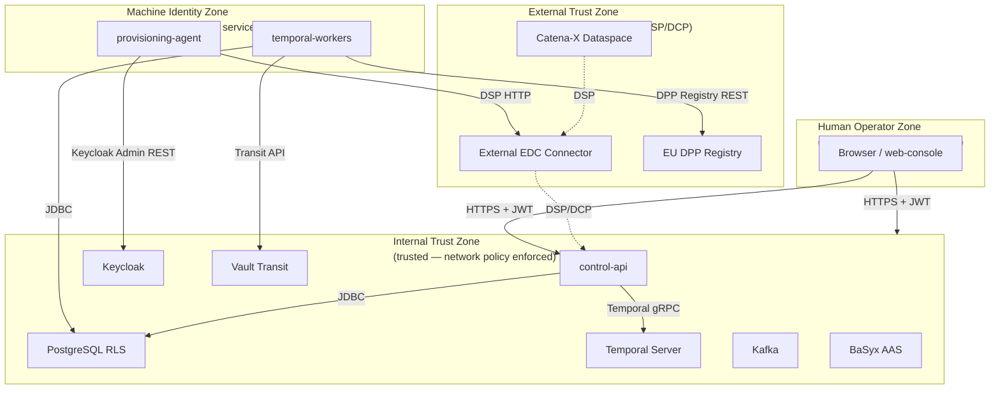

# Threat Model: System Context

## Trust Boundaries

The platform has four distinct trust zones. Each trust boundary crossing is a potential attack surface and requires explicit authentication, authorization, and integrity checks.

**Boundary crossing rules:**

| Crossing | Authentication mechanism | Authorization check |
|---------|------------------------|-------------------|
| Operator → control-api | Keycloak JWT (Authorization Code + PKCE) | Keycloak role claim (`operator`, `viewer`) |
| External EDC → control-api (DSP) | DCP Verifiable Presentation | VC type and issuer verification |
| provisioning-agent → Keycloak Admin REST | Keycloak client_credentials | Admin realm role |
| temporal-workers → Vault Transit | Vault AppRole + policy | `dataspace-signer` policy |
| temporal-workers → Postgres | PostgreSQL role + RLS | `app.tenant_id` session variable |
| control-api → Postgres | PostgreSQL role + RLS | `app.tenant_id` session variable |

## Key Assets

The following assets are the primary targets for attackers and the primary focus of mitigations:

| Asset | Location | Sensitivity | Primary threat class |
|-------|---------|------------|---------------------|
| **Tenant data** (companies, agreements, passports) | Postgres `dataspace-infra` | High | Information Disclosure (cross-tenant leakage) |
| **Private signing keys** | Vault Transit (never exported) | Critical | Information Disclosure, Elevation of Privilege |
| **Keycloak admin credentials** | Vault at `secret/platform/keycloak-admin` | High | Elevation of Privilege |
| **Service account client_secrets** | Vault at `secret/platform/*/keycloak-client-secret` | High | Spoofing, Elevation of Privilege |
| **Temporal workflow history** | Temporal Postgres | Medium | Tampering (historical audit trail), Repudiation |
| **Evidence artifacts** | Postgres `evidence_records` (append-only) + Kafka | High | Tampering (regulatory compliance trail) |
| **Vault unseal keys** | Distributed among key holders (not stored in cluster) | Critical | Denial of Service (permanent seal), Elevation of Privilege |

## Key Threat Surfaces

| Surface | Exposure | Protection |
|---------|---------|-----------|
| **control-api HTTP (public ingress)** | Public internet via Nginx ingress | JWT authentication, rate limiting, TLS termination at ingress |
| **EDC connector DSP interface** | Public — receives DSP messages from Catena-X partners | DCP credential presentation verification, ODRL policy validation |
| **Temporal gRPC** | Internal only (network policy) | Not exposed via ingress; gRPC client must be in platform namespace |
| **Vault API** | Internal only (network policy) | AppRole auth; network policy restricts to platform namespace |
| **Keycloak Admin REST** | Internal only (network policy) | Admin credentials in Vault; only provisioning-agent has access |
| **Postgres wire protocol** | Internal only (network policy) | TLS + Postgres role + RLS; not exposed via ingress |
| **OTel Collector OTLP** | Internal only (network policy) | Not exposed to external; collector runs in platform namespace |
| **Kafka brokers** | Internal only (network policy) | TLS + SASL authentication; only temporal-workers and metering service have produce access |

## Threat Surface: External EDC Connector (DSP/DCP)

The EDC connector interface is the highest-risk external surface because:
1. It receives structured messages from untrusted external parties
2. ODRL policy payloads contain executable policy expressions that are parsed and evaluated
3. DCP credential presentations from counterparties must be verified against DIDs that are fetched from external registries (DID document fetch is an SSRF risk)

Mitigations for DSP/DCP surface:
- ODRL policy payloads validated against `schemas/odrl/` before parsing (see T-DI-02 threat in data-integrity)
- DCP credential verification includes issuer DID resolution — DID resolver is sandboxed and rate-limited
- DSP message rate limiting per counterparty BPN
- All DSP/DCP interactions produce audit events
